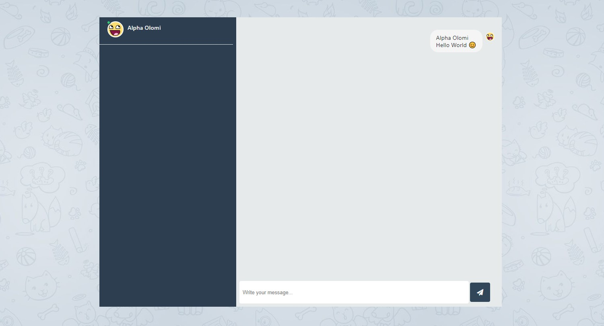

# LaraChat v1.0 [![Software License][ico-license]](LICENSE.md) [![Build Status][ico-travis]][link-travis] [![Coverage Status][ico-codecov]][link-codecov]

A cool chat applicatin using websocket



## Change log

Please see [CHANGELOG](CHANGELOG.md) for more information on what has changed recently.

## Testing

```bash
$ composer test
```

## Contributing

Please see [CONTRIBUTING](./.github/CONTRIBUTING.md) and [CODE_OF_CONDUCT](./.github/CODE_OF_CONDUCT.md) for details.

## Security

If you discover any security related issues, please email hello@alphaolomi.com instead of using the issue tracker.

## Credits

-   [Alpha Olomi][link-author]
-   [All Contributors][link-contributors]

## License

The MIT License (MIT). Please see [License File](LICENSE.md) for more information.

[ico-license]: https://img.shields.io/badge/license-MIT-brightgreen.svg?style=flat-square
[ico-travis]: https://img.shields.io/travis/com/alphaolomi/laravel-websockets?logo=travis&style=flat-square
[ico-codecov]: https://img.shields.io/codecov/c/gh/alphaolomi/laravel-websockets?logo=codecov&style=flat-square
[link-travis]: https://travis-ci.com/alphaolomi/laravel-websockets
[link-codecov]: https://codecov.io/gh/alphaolomi/laravel-websockets
[link-author]: https://github.com/alphaolomi
[link-contributors]: ../../contributors
